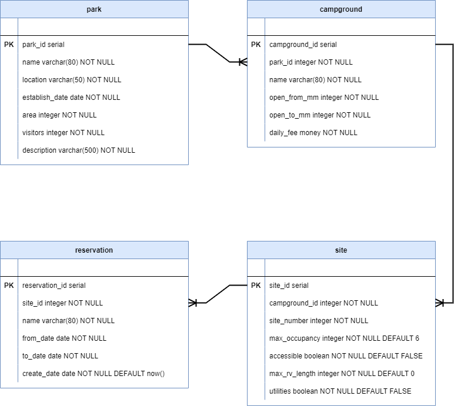

# Review: National Park Campsite

You're a developer hired by the National Park Service. For your first assignment, your manager tasked you with writing queries against the National Park Campsite Reservation database. Before you write queries, you'll need to review the database's schema and data.

## Step One: Getting started

1. Create a new database called `campground`.
2. Select the new database and open the `database/campground.sql` file in pgAdmin.
3. Run the database script in the file by clicking the **Execute/Refresh** button.

## Step Two: Review database schema and data

Before writing any queries, you need to review each table. Focus on understanding the purpose of each table, the primary and foreign keys, constraints, and how the tables relate to each other. Then, look at the sample data in each of the tables.

Here is a drawing of the database schema. Following the drawing are details about each table.

### Park table

The `park` table provides the data for each of the supported national parks. The data columns are as follows:

|    | Field          | Description                                |
|----|----------------|--------------------------------------------|
| PK | park_id        | A surrogate key for the park.              |
|    | name           | The name of the park.                      |
|    | location       | The location of the park.                  |
|    | establish_date | The creation date of the park.             |
|    | area           | The size of the park in square kilometers. |
|    | visitors       | The annual number of visitors to the park. |
|    | description    | A short description about the park.        |

### Campground table

The `campground` table provides a list of the one or many campgrounds located inside of a national park. The data columns are as follows:

|    | Field         | Description                                                                                       |
|----|---------------|---------------------------------------------------------------------------------------------------|
| PK | campground_id | A surrogate key for the campground.                                                               |
| FK | park_id       | The park that contains the campground.                                                            |
|    | name          | The name of the campground.                                                                       |
|    | open_from_mm  | The first numerical month the campground is open for reservation. (1: January, 2: February, etc.) |
|    | open_to_mm    | The last numerical month the campground is open for reservation. (1: January, 2: February, etc.)  |
|    | daily_fee     | The daily fee for booking a campsite at this campground.                                          |

### Site table

The `site` table lists all of the campsites available for reservation in a campground. The data columns are as follows:

|    | Field         | Description                                                                                        |
|----|---------------|----------------------------------------------------------------------------------------------------|
| PK | site_id       | A surrogate key for the campsite.                                                                  |
| FK | campground_id | The campground that contains the site.                                                             |
|    | site_number   | The arbitrary campsite number.                                                                     |
|    | max_occupancy | Maximum occupancy at the campsite.                                                                 |
|    | accessible    | Indicates whether or not the campsite is handicap accessible.                                      |
|    | max_rv_length | The maximum RV length that the campsite can fit. 0 indicates that no RV fits at this campsite.     |
|    | utilities     | Indicates whether or not the campsite provides access to utility hookup.                           |

### Reservation table

The `reservation` table lists all of the past, current, and future reservations for a campsite in the national park system. The data columns are as follows:

|    | Field          | Description                          |
|----|----------------|--------------------------------------|
| PK | reservation_id | A surrogate key for the reservation. |
| FK | site_id        | The campsite for the reservation.    |
|    | name           | The name for the reservation.        |
|    | from_date      | The start date of the reservation.   |
|    | to_date        | The end date of the reservation.     |
|    | create_date    | The booking date of the reservation. |

## Step Three: Read data from a database

In pgAdmin, open `step-3.sql`. Each SQL statement you need to write starts with a comment describing the requirements. In this step, you'll write 13 queries.

> Note: If you need to select all columns from a table, avoid using `select *` in favor of column names.

## Step Four: Query from multiple tables

In pgAdmin, open `step-4.sql`. Each SQL statement you need to write starts with a comment describing the requirements. In this step, you'll write four queries.

## Step Five: Add, modify, and remove data from a database

In pgAdmin, open `step-5.sql`. You need to add a new park, campground, sites, and reservations to the National Park Database. Each SQL statement you need to write starts with a comment describing the requirements. In this step, you'll write seven queries.
