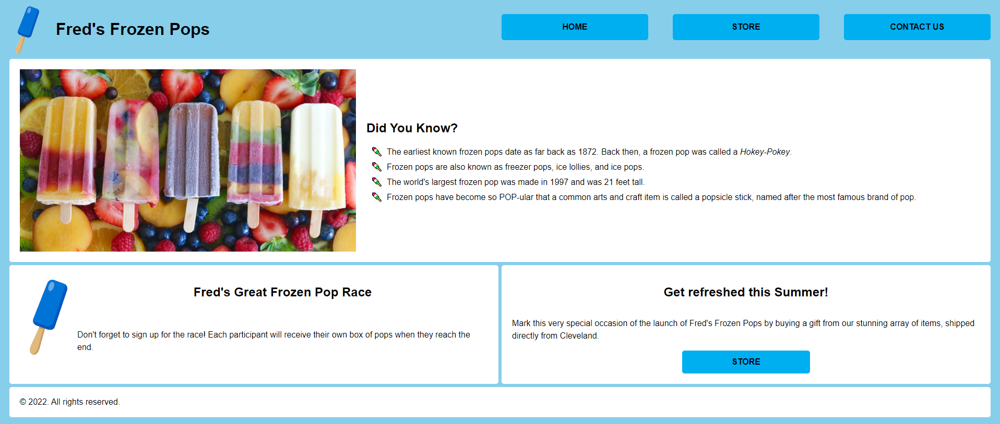
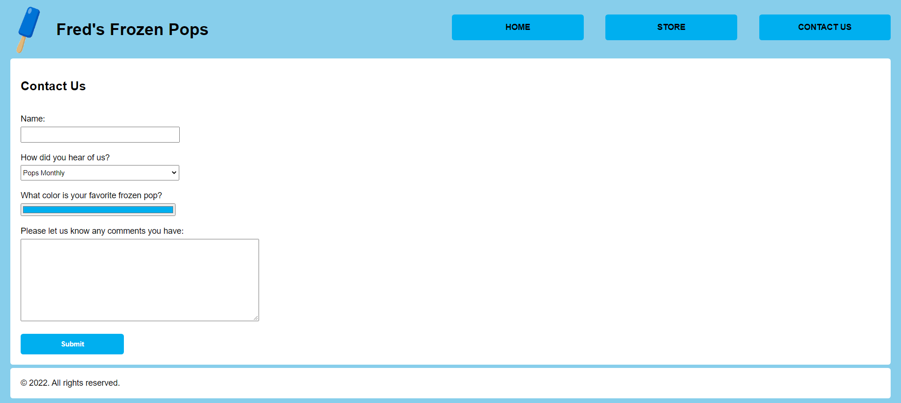
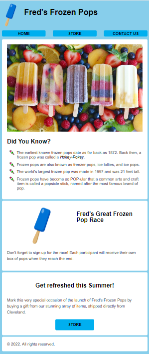
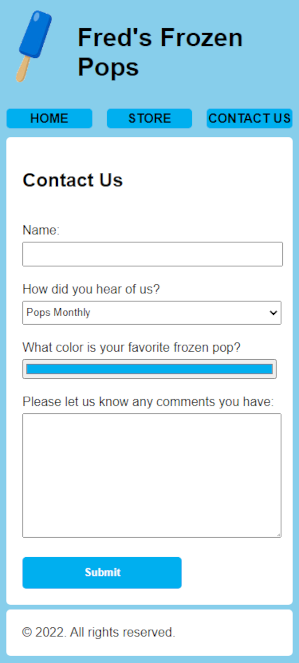

# Week 9 Pair Exercises: Fred's Frozen Pops

## Context

Fred's Frozen Pops has asked you to create their homepage and a contact form. The design team has created mockups of the homepage and contact form, both in desktop and mobile formats.

Before you start, be sure to review the provided CSS for styling rules that are already defined, and look at the mockups that follow.

## Desktop layouts

## Mobile layouts

## Requirements

* Use semantic HTML
* Use CSS Grid for the main layout
* Use CSS ID/class selectors and combinators
* Apply an effect to hyperlinks when the mouse is over it

## Notes and tips

* The mobile breakpoint can be 800px since a separate tablet layout isn't required.
* Make sure your final design is as close to the mockups as possible—note the margins, paddings, heights, and widths.
  * If you're off by a pixel or two, that's fine, but your finished product must closely resemble the mockups.
* Take advantage of starting code in `styles.css` - it's there to help you get started.
* It might be helpful to use Grid or Flexbox to align elements within sections.
