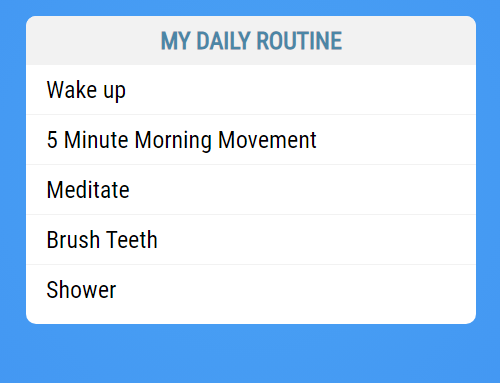
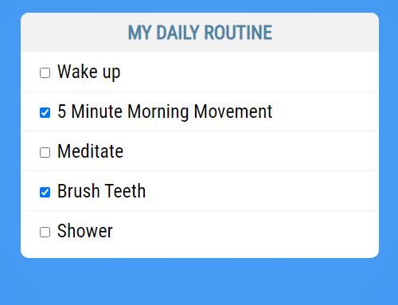
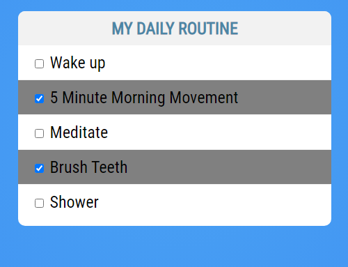
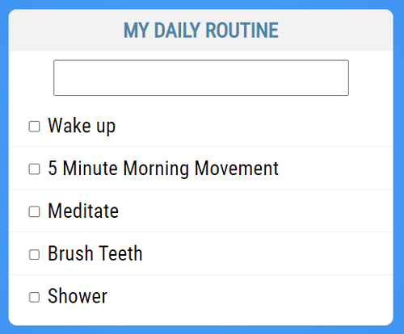
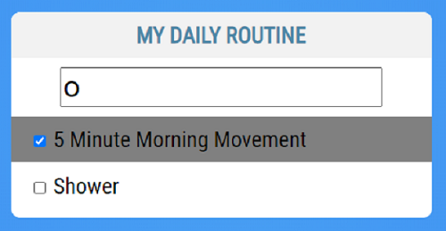

# Intro to Vue.js tutorial

In the reading material, you read about Vue and data binding. In this tutorial, you'll write your first Vue component and add it to an existing project. You can find the project in the same directory as this file.

## Step One: Run `npm install`

This is an existing project that has some dependencies that aren't stored in source control. To install the project's dependencies, run the following command:

```bash
npm install
```

## Step Two: Build out your `TodoList` component

Now, you'll build out a todo list component. Once you've built that component, you'll import it into your main application and display it on the screen. Then, you'll add features to demonstrate dynamic data binding in Vue.

In your `components` folder, create a new file called `TodoList.vue`. A new component usually consists of three pieces:

* HTML: `<template></template>`
* JavaScript: `<script></script>`
* CSS: `<style></style>`

Copy and paste the following code into your new component, or if you have the [Vetur Extension](https://marketplace.visualstudio.com/items?itemName=octref.vetur) installed, type out `vue` and press `Tab` to create this:

```html
<template>

</template>

<script>
export default {

}
</script>

<style>

</style>
```

Start by adding the markup for the todo list. You can copy and paste the following code inside of the `<template></template>` tag:

```html
<div class="todo-list">
    <h1>My Daily Routine</h1>
    <ul>
        <li>Wake Up</li>
        <li>5 Minute Morning Movement</li>
        <li>Meditate</li>
        <li>Brush Teeth</li>
        <li>Shower</li>
    </ul>
</div>
```

Next, add the following CSS code between the `<style></style>` tag to give your list some style. Feel free to copy and paste this part instead of typing it all in:

```css
.todo-list {
    width: 450px;
    background: #fff;
    margin: 50px auto;
    padding-bottom: 10px;
    font-family: 'Roboto Condensed', sans-serif;
    border-radius: 10px;
}
h1 {
    background: #f2f2f2;
    color: #4b86A6;
    padding: 10px;
    font-size: 24px;
    text-transform: uppercase;
    text-align: center;
    margin-bottom: 10px;
    border-top-left-radius: 10px;
    border-top-right-radius: 10px;
}
ul {
    list-style-type: none;
    margin: 0px;
    padding: 0px;
}
li {
    font-size: 24px;
    border-bottom: 1px solid #f2f2f2;
    padding: 10px 20px;
}
li:last-child {
    border: 0px;
}
```

Leave the `<script></script>` tags empty.

## Step Three: Add the new component to `App.vue`

To use the component in the application, you need to import it first. Open `App.vue`, and at the beginning of your JavaScript section, add a new import line to import your new component:

```javascript
import TodoList from './components/TodoList';
```

Then add the component to the components section of the Vue object:

```javascript
components: {
  TodoList
}
```

Now that you've imported the component, use it in the HTML portion of the `App` component. The name of the component is `TodoList`. Follow the naming standard for components, which says that all custom-made HTML elements must be all lowercase and include a hyphen. This means that for this tutorial, the component is `<todo-list></todo-list>`:

```html
<template>
  <div id="todo-app">
    <todo-list></todo-list>
  </div>
</template>
```

## Step Four: Run your Todo application

Run the application using `npm run serve` and visit http://localhost:8080. The application looks as follows:



## Step Five: Add data binding to your Todo application

Next, you'll make the application more dynamic by having the todo items in JavaScript data instead of hard-coded in the HTML of the component.

Open the `TodoList.vue` component and remove all of the hard-coded list items:

```html
<template>
    <div class="todo-list">
        <h1>My Daily Routine</h1>
        <ul>
        </ul>
    </div>
</template>
```

Create an empty array inside the return of the data function:

```javascript
<script>
export default {
  data() {
    return {
      todos: []
    }
  }
}
</script>
```

Add JavaScript objects for each todo item to the todo array:

```javascript
<script>
export default {
  data() {
    return {
      todos: [
        {
          name: 'Wake up'
        },
        {
          name: '5 Minute Morning Movement'
        },
        {
          name: 'Meditate'
        },
        {
          name: 'Brush Teeth'
        },
        {
          name: 'Shower'
        }
      ]
    }
  }
}
</script>
```

Use the `v-for` directive to display them in the list. Place the following code inside of the `<ul></ul>` tags in your template:

```html
<h1>My Daily Routine</h1>
<ul>
  <li v-for="todo in todos" v-bind:key="todo.name">{{ todo.name }}</li>
</ul>
```

Run the application using `npm run serve`. Visit http://localhost:8080 to see the same list you had before:


The difference now is that you aren't hard-coding the values in the markup. You created a todo array, and dynamically iterated over that array to display the list.

## Step Six: Add dynamic data with two-way data binding

Next, add checkboxes to each of the todo items so the user can mark them as completed. To do this, add a new data property to each of the todo items in the `data()` section of the component. Call it `done` and default it to `false`:

``` JavaScript
data() {
  return {
    todos: [
      {
        name: 'Wake up',
        done: false
      },
      {
        name: '5 Minute Morning Movement',
        done: false
      },
      {
        name: 'Meditate',
        done: false
      },
      {
        name: 'Brush Teeth',
        done: false
      },
      {
        name: 'Shower',
        done: false
      }
    ]
  }
}
```

Create the checkbox in the `<li>` element and use `v-model` to connect it to the new `done` property:

``` HTML
<li v-for="todo in todos" v-bind:key="todo.name">
  <input type="checkbox" v-model="todo.done" />
  {{ todo.name }}
</li>
```

Run your project again to confirm you can check and clear the box next to the todo item:



## Step Seven: Data bind CSS classes on elements

Add a grey background color on the todo item when it's marked as `done`. To do this, use the `done` property to toggle a class on the `<li>`.

First, create the class:

``` CSS
.finished {
    background-color: grey;
}
```

Then, in the `<li>` defined earlier, add the following `v-bind:class` that adds the `finished` class when `done` is true and removes it when `done` is false:

``` HTML
<li v-for="todo in todos" v-bind:key="todo.name"
    v-bind:class="{ finished: todo.done }">
  <input type="checkbox" v-model="todo.done" />
  {{ todo.name }}
</li>
```

Remember that `v-bind:class` takes a JavaScript object where the key is the name of a CSS class, and the value is a boolean determining whether the class gets added to the element. In the previous example, `finished` is the class, and `todo.done` is the boolean data property that says whether to add the class (`true`) or remove it (`false`).

Clicking on the checkboxes now greys out the item in the list, and un-checking a box returns it to normal:



## Step Eight: Filter the Todo items

The last feature you'll add is the ability to filter the todo items so that you only show the items that match a user's search criteria. There are many steps to get this working, so work through each one in order.

First, capture the user's input by adding a new data property to the component called `filterText`:

``` JavaScript
data() {
    return {
      filterText: '',
      todos: [
        ...
```

Then bind that to an input field after the todo list:

``` HTML
    </ul>
    <input type="text" v-model="filterText" />
  </div>
</template>
```

Next, add CSS to lay out the input field:

``` CSS
input[type=text] {
    width: 75%;
    margin: auto;
    margin-bottom: 10px;
    font-size: 2em;
    display: block;
}
```

Now, any value typed into the text field updates the `filterText` data property with the same value.

To create the filtered list of items, requires a new list. You can't change the original list of items because you don't want to lose items on the list—just temporarily filter them. If the filter text is empty, you need to show all the items again.

To do this, use a `computed` property. The data property always contains all the todo items, but the computed property returns only the subset of that data property that matches the `filterText`.

Create the computed section of your component under the `data(){...}` section:

``` JavaScript
computed: {

}
```

Then write a method that returns an array of todos containing the filter text. To access the component itself, use the `this` variable:

``` JavaScript
computed: {
  filteredTodos() {
    return this.todos.filter((todo) => {
      return todo.name.includes(this.filterText);
    });
  }
}
```

Use the new `filteredTodos` property rather than the `todos` property in your `v-for` loop:

``` HTML
<li v-for="todo in filteredTodos" v-bind:key="todo.name"
    v-bind:class="{ finished: todo.done }">
```

The completed applications looks like this:



When you type in the text field, you'll see a real-time, updated list of todos based on the text typed into the filter:



## Summary

In this tutorial, you:

- Learned how to create new component using HTML, JavaScript, and CSS
- Added a new component to a Vue project
- Used data binding to connect a component's UI and properties
- Used `v-for` to create a list in HTML from a JavaScript array
- Added a checkbox connected to a data property for dynamic updates
- Used `v-bind` to bind a data property to class attributes
- Used a computed property to dynamically modify data display
